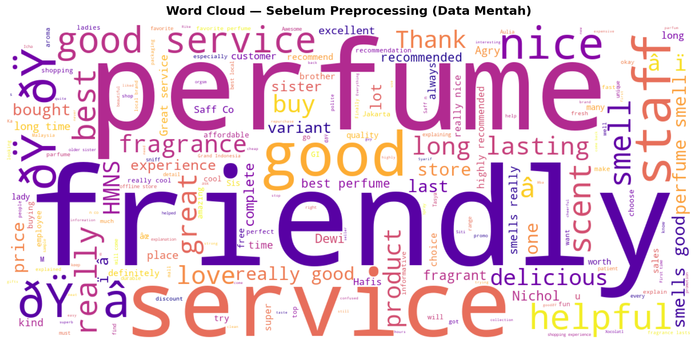
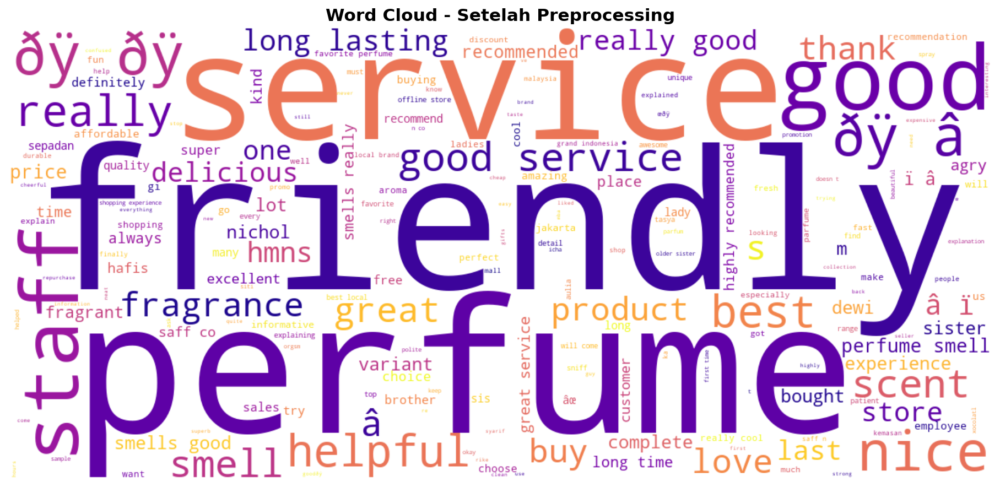

# Pipeline Preprocessing & Klasifikasi Sentimen Ulasan Parfum Lokal

**Tugas Besar — Mata Kuliah Data, Informasi, dan Pengetahuan**  
Program Studi Informatika, Universitas Muhammadiyah Malang

---

## Identitas Mahasiswa

| Field | Detail |
|---|---|
| Nama | Muhammad Iqbal Fadel |
| NIM | 202310370311268 |
| Kelas | Data, Informasi dan Pengetahuan / C |
| Dosen | Vinna Rahmayanti S, S.Si., M.Si |

---

## Deskripsi Proyek

Proyek ini membangun pipeline end-to-end untuk preprocessing dan klasifikasi sentimen teks ulasan parfum lokal berbahasa Indonesia. Data bersumber dari Google Review dan Twitter/X, yang mengandung banyak bahasa gaul, singkatan, dan istilah campuran Indonesia-Inggris.

Rantai transformasi yang dibangun mengikuti konsep:

```
Data (Teks Mentah)  ->  Informasi (Teks Bersih + Label)  ->  Pengetahuan (Model ML + Slang Dictionary)
```

- **Data**: Teks mentah ulasan parfum yang mengandung singkatan ("bgt", "sis"), typo, dan bahasa campuran ("worth it", "long lasting").
- **Informasi**: Teks bersih berlabel sentimen (Positif / Negatif / Netral) siap pakai untuk machine learning.
- **Pengetahuan**: Model Naive Bayes terlatih (akurasi 92,53%) dan Kamus Normalisasi 120 entri khusus domain parfum yang dapat digunakan ulang oleh peneliti lain.

---

## Struktur Folder

```
TUBES/
|
+-- data/
|   +-- raw/            <- Dataset mentah (.csv)
|   +-- interim/        <- Data setelah basic cleaning
|   +-- processed/      <- Dataset final berlabel sentimen (.csv)
|
+-- scripts/
|   +-- 02_data_profiling/          <- Analisis kualitas data awal
|   +-- 03_basic_cleaning/          <- Case folding, regex, filtering
|   +-- 04_advanced_normalization/  <- Normalisasi slang ke bahasa baku
|   +-- 05_labeling/                <- Pelabelan sentimen berbasis keyword
|   +-- 06_validation/              <- Validasi integritas data
|   +-- 07_machine_learning/        <- Klasifikasi sentimen (SVM & Naive Bayes)
|   +-- utils/                      <- Fungsi helper dan logger
|
+-- dictionary/      <- Slang Dictionary domain parfum (120 entri, 10 kategori)
|
+-- docs/
|   +-- jurnal/               <- Draft artikel jurnal SINTA
|   +-- presentasi/           <- Slide presentasi
|   +-- laporan_mingguan/     <- Log progress tiap dua minggu (Minggu 1-16)
|
+-- results/
|   +-- figures/        <- Grafik, Word Cloud, Confusion Matrix
|   +-- reports/        <- Laporan evaluasi otomatis & sampel validasi manual
|   +-- models/         <- Model ML (.pkl) dan TF-IDF Vectorizer (.pkl)
|
+-- logs/            <- Log eksekusi skrip
+-- README.md
+-- requirements.txt
+-- config.py        <- Konfigurasi path dan parameter global
+-- run_pipeline.py  <- Master script pipeline preprocessing
```

---

## Cara Menjalankan

### 1. Instalasi Dependensi

```bash
pip install -r requirements.txt
```

### 2. Jalankan Pipeline Preprocessing (Tahap 1-5)

Bisa dijalankan sekaligus lewat master script:

```bash
python run_pipeline.py
```

Atau dijalankan per tahap secara manual:

```bash
python scripts/02_data_profiling/profiling.py
python scripts/03_basic_cleaning/basic_cleaning.py
python scripts/04_advanced_normalization/normalization.py
python scripts/05_labeling/labeling.py
python scripts/06_validation/validation.py
```

### 3. Jalankan Pipeline Machine Learning

```bash
python scripts/07_machine_learning/modelling.py
```

---

## Contoh Transformasi Teks

Berikut contoh nyata hasil kerja pipeline ini:

| Teks Mentah | Teks Bersih | Teks Ternormalisasi |
|---|---|---|
| `Ok bgt wanginya` | `ok bgt wanginya` | `ok sangat aromanya` |
| `Ga worth sih harganya` | `ga worth sih harganya` | `tidak sepadan sih harganya` |
| `rekomen bgt buat yg suka wangi soft` | `rekomen bgt buat yg suka wangi soft` | `rekomendasikan sangat buat yang suka aroma lembut` |
| `Saff&co parfum ter the best bgt` | `saff co parfum ter the best bgt` | `saff co parfum ter the best sangat` |

---

## Word Cloud: Sebelum vs Sesudah Preprocessing

| Sebelum Preprocessing | Sesudah Preprocessing |
|---|---|
|  |  |

Perbandingan lebih lengkap tersedia di: `results/figures/comparison_before_after.png`

---

## Hasil Machine Learning

### Perbandingan Model

| Model | Akurasi | F1-Macro | F1-Weighted | Penanganan Imbalance |
|---|---|---|---|---|
| Naive Bayes (terbaik) | 92,53% | 0,7102 | 0,9227 | SMOTE pada data latih |
| SVM (LinearSVC) | 89,66% | 0,6163 | 0,8776 | class_weight='balanced' |

Model terbaik: **Multinomial Naive Bayes** dengan akurasi **92,53%** dan F1-Weighted **0,9227**.

### Distribusi Label Dataset

| Label | Jumlah | Persentase |
|---|---|---|
| Positif | 756 | 87,1% |
| Netral | 103 | 11,9% |
| Negatif | 9 | 1,0% |

---

## Statistik Dataset

| Metrik | Nilai |
|---|---|
| Data mentah awal | 1.170 baris |
| Data valid setelah profiling | 1.122 baris |
| Data duplikat yang dihapus | 199 baris (17,74%) |
| Data bersih setelah cleaning | 868 baris (77,4% tersisa) |
| Entri kamus slang | 120 entri, 10 kategori |
| Coverage slang pada dataset | 0,56% token |
| Reduksi panjang teks rata-rata | 4,9% |

---

## Timeline Pengerjaan

| Minggu | Fase | Status |
|---|---|---|
| 1-2 | Inisiasi & Akuisisi Data (1.122 baris) | Selesai |
| 3-4 | Data Profiling (17,74% duplikat, 6 visualisasi) | Selesai |
| 5-6 | Basic Cleaning (868 baris bersih, 77,4% tersisa) | Selesai |
| 7-8 | Advanced Normalization — 120 entri kamus (UTS) | Selesai |
| 9-10 | Labeling — Positif 87,1% / Netral 11,9% / Negatif 1,0% | Selesai |
| 11-12 | Validasi — 0 noise tersisa, integrity check lulus | Selesai |
| 13-14 | Machine Learning (92,53%) & Draft Jurnal | Selesai |
| 15-16 | Final Submission (UAS) | Selesai |

---

## Referensi

- Haddi, E., Liu, X., & Shi, Y. (2013). The role of text pre-processing in sentiment analysis. *Procedia Computer Science*, 17, 26-32.
- Rahardi, R., et al. (2022). E-Commerce Review NLP. *Springer Electronic Commerce Research*. https://link.springer.com/article/10.1007/s10660-022-09582-4

---

## Lisensi

Proyek ini dibuat untuk keperluan akademik. Dataset dan kamus normalisasi bebas digunakan untuk penelitian dengan mencantumkan sumber.
