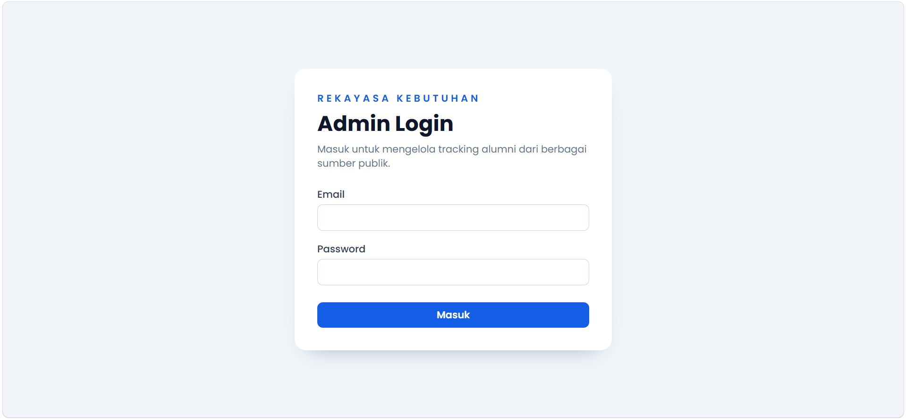
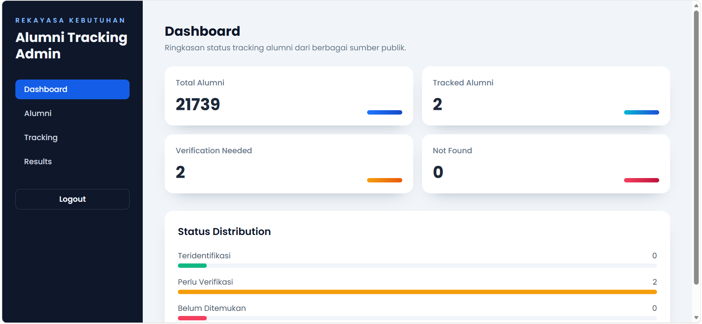
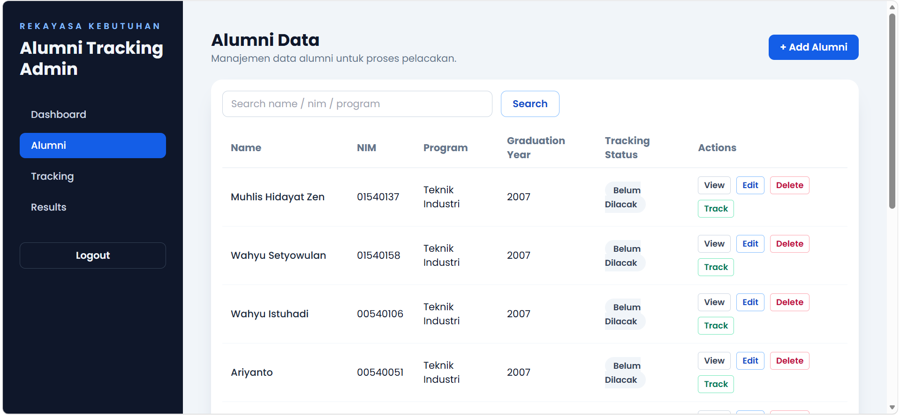
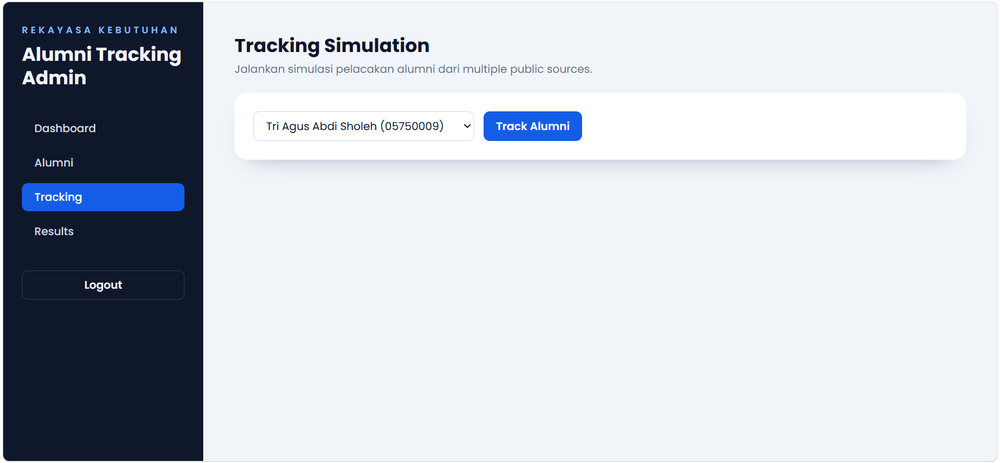
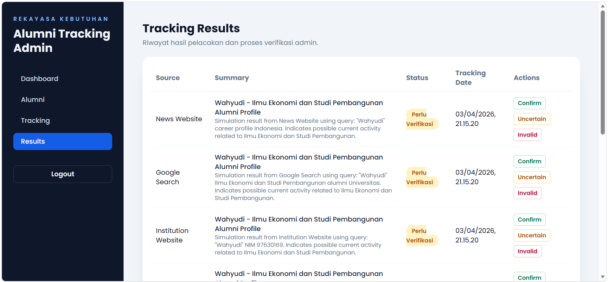

# Alumni Tracker

Implementasi sistem pelacakan alumni berbasis web untuk memenuhi tugas Daily Project mata kuliah Rekayasa Kebutuhan. Aplikasi ini membantu admin mengelola data alumni, melakukan proses pelacakan dari sumber publik, dan memverifikasi hasil pelacakan secara terstruktur.

## 1. Deskripsi Singkat Sistem

Alumni Tracker adalah aplikasi web full-stack dengan arsitektur frontend-backend terpisah. Sistem menyediakan dashboard monitoring, manajemen data alumni, simulasi proses pelacakan, serta verifikasi hasil pelacakan untuk mendukung pengambilan keputusan oleh admin.

## 2. Informasi Mahasiswa

- Nama: Muhammad Iqbal Fadel
- NIM: 202310370311268
- Kelas: Rekayasa Kebutuhan / A

## 3. Informasi Tugas

Dokumen ini disusun untuk memenuhi ketentuan Daily Project:

- Produk yang diimplementasikan berbentuk web application.
- Menyertakan link source code GitHub dan link aplikasi yang sudah dipublish.
- Melakukan pengujian sesuai aspek kualitas yang dirancang pada Daily Project 2.
- Menyajikan hasil pengujian dalam bentuk tabel pada README.

## 4. Tujuan Sistem

Tujuan pengembangan Alumni Tracker adalah:

1. Menyediakan media terpusat untuk manajemen data alumni.
2. Mempermudah proses pelacakan alumni berdasarkan berbagai sumber publik.
3. Mendukung proses verifikasi hasil pelacakan oleh admin.
4. Menyajikan informasi status alumni secara cepat melalui dashboard.

## 5. Fitur Utama Aplikasi

- Autentikasi admin berbasis Laravel Sanctum.
- Dashboard statistik alumni (total data, status teridentifikasi, perlu verifikasi, belum ditemukan).
- CRUD data alumni (tambah, lihat, ubah, hapus).
- Simulasi pelacakan alumni dan penyimpanan kandidat hasil.
- Verifikasi hasil pelacakan dengan status `confirm`, `uncertain`, dan `invalid`.
- Riwayat hasil pelacakan untuk audit dan monitoring.

## 6. Teknologi yang Digunakan

- Laravel (Backend API)
- React + Vite (Frontend)
- TailwindCSS
- MySQL
- REST API
- Railway (Backend deployment)
- Vercel (Frontend deployment)

## 7. Arsitektur Sistem (Frontend + Backend + Database)

Arsitektur sistem menggunakan pola client-server:

- Frontend: React + Vite sebagai antarmuka pengguna admin.
- Backend: Laravel REST API untuk autentikasi, logika bisnis, dan akses data.
- Database: MySQL untuk penyimpanan data pengguna, alumni, dan hasil pelacakan.

Alur komunikasi:

1. Frontend mengirim request HTTP ke backend API.
2. Backend memproses request, validasi, dan query ke MySQL.
3. Backend mengembalikan response JSON ke frontend.
4. Frontend menampilkan hasil ke pengguna.

## 8. Cara Menjalankan Project Secara Lokal

### 8.1 Menjalankan Backend (Laravel)

```bash
cd backend
cp .env.example .env
composer install
php artisan key:generate
```

Sesuaikan konfigurasi database pada `backend/.env`, lalu jalankan:

```bash
php artisan migrate
php artisan db:seed
php artisan serve
```

Default backend lokal:

- URL: `http://127.0.0.1:8000`
- Akun admin seeder:
  - Email: `admin@alumni-tracker.test`
  - Password: `password`

### 8.2 Menjalankan Frontend (React + Vite)

```bash
cd frontend
npm install
```

Buat file `frontend/.env`:

```env
VITE_API_URL=http://127.0.0.1:8000/api
```

Jalankan frontend:

```bash
npm run dev
```

Default frontend lokal: `http://localhost:5173`

## 9. Link Deploy Aplikasi

- Repository GitHub (source code):
  https://github.com/diibul/semester-6/tree/main/REKAYASA%20KEBUTUHAN/daily-project-3
- Frontend (published):
  https://semester-6-two.vercel.app/login
- Backend API:
  https://alumni-tracker.up.railway.app

### 9.1 Akun Uji Sistem (Untuk Dosen)

Gunakan akun berikut untuk pengujian fitur login dan alur utama aplikasi pada sistem publish:

- Email: `admin@alumni-tracker.test`
- Password: `password`

Catatan: akun ini disediakan khusus untuk kepentingan evaluasi akademik.

## 10. Populasi Data Alumni (Daily Project 4)

### 10.1 Ringkasan Hasil Populasi Data

Populasi data alumni dilakukan menggunakan importer bulk CSV dari dataset tugas dosen. Proses ini menghasilkan:

- **Total alumni yang berhasil diimport (lingkungan lokal)**: 109,915 records
- **Total baris CSV yang dibaca**: 142,292 baris
- **Baris yang berhasil diproses**: 136,204 baris (95.7%)
- **Baris yang dilewati**: 6,088 baris (4.3% - karena data wajib kurang: NIM/nama/program studi/tahun lulus)

Catatan: jumlah data pada sistem public dapat berbeda karena sinkronisasi data dilakukan bertahap.

### 10.2 Metode Pengumpulan Data

Data alumni diperoleh dari file Excel/Sheets yang diberikan dosen untuk kebutuhan tugas akademik. Sumber data mentah tidak dipublikasikan di repository ini.

**Kolom dasar dari Sheets:**
1. Nama Lulusan
2. NIM
3. Tahun Masuk
4. Tanggal Lulus
5. Fakultas
6. Program Studi

**Kolom tambahan yang ditambahkan ke sistem (untuk kelengkapan data):**
7. Alamat Sosial Media (LinkedIn, Instagram, Facebook, TikTok)
8. Email
9. No HP
10. Tempat Bekerja
11. Alamat Bekerja
12. Posisi
13. Status Pekerjaan (PNS / Swasta / Wirausaha)
14. Alamat Sosial Media Tempat Bekerja

### 10.3 Alur Importer

Importer bulk menggunakan command Artisan Laravel dengan fitur:

1. **Validasi format CSV** - Deteksi delimiter otomatis (koma atau semicolon)
2. **Normalisasi header** - Mapping otomatis header CSV ke field database
3. **Parsing tanggal multi-format** - Support tanggal format Indonesia (d Bulan Y, e.g., "1 Juli 2000")
4. **Ekstraksi URL sosial media** - Parse URL dari kolom sosial media bundle
5. **Validasi data wajib** - Hanya import jika name, nim, study_program, dan graduation_year tersedia
6. **Dry-run mode** - Validasi sebelum simpan ke database

**Command untuk menjalankan importer:**
```bash
php artisan alumni:import-csv "storage/app/import/alumni.csv"
```

### 10.4 Struktur Data Alumni di Database

Konfigurasi tabel alumni sudah diperluas dengan migration terpisah untuk mendukung 14 kolom data:

```php
// Kolom identitas alumni
- id (bigint, PK)
- name (varchar, required)
- nim (varchar, required, unique)
- entry_year (smallint, nullable)
- graduation_date (date, nullable)
- faculty (varchar, nullable)
- study_program (varchar, required)
- graduation_year (smallint, required)

// Kolom kontak dan sosial media alumni
- email (varchar, nullable)
- social_media_linkedin (varchar, nullable)
- social_media_instagram (varchar, nullable)
- social_media_facebook (varchar, nullable)
- social_media_tiktok (varchar, nullable)
- phone_number (varchar, nullable)

// Kolom informasi pekerjaan alumni
- workplace_name (varchar, nullable)
- workplace_address (text, nullable)
- position (varchar, nullable)
- employment_type (enum: PNS/Swasta/Wirausaha, nullable)
- workplace_social_media (varchar, nullable)

// Kolom tracking
- tracking_status (enum: Belum Dilacak/Teridentifikasi/Perlu Verifikasi/Belum Ditemukan)
- created_at & updated_at (timestamp)
```

### 10.5 Verifikasi Data Sampel

Berikut contoh beberapa alumni yang berhasil di-import:

| Nama | NIM | Program Studi | Tanggal Lulus |
|---|---|---|---|
| WASILATIL MAGHFIRAH | 202220631014296 | Pendidikan Profesi Guru | 2023-11-15 |
| Mahesa Zukruf Anggeresta | 201810040311393 | Ilmu Komunikasi | 2023-09-20 |
| NUR AINI YAN MEINATI | 202220631014524 | Pendidikan Profesi Guru | 2023-11-15 |
| WIDYA WARAPSARI EKA PUTRI | 202220631014479 | Pendidikan Profesi Guru | 2023-11-15 |
| TAMAMI MAESAROH | 202220631014477 | Pendidikan Profesi Guru | 2023-11-15 |

**Ringkasan kualitas data saat ini:**
- Total alumni: 109,915
- Alumni dengan email: 1
- Alumni dengan No HP: 0
- Alumni dengan data pekerjaan: 0

Data kontak dan pekerjaan pada sistem diisi bertahap dari sumber publik yang terverifikasi, sementara dataset utama tetap disimpan dan divalidasi secara lokal.

### 10.6 Ringkasan Enrichment Data Publik (Teranonimkan)

Sebagai bukti proses tracking, dilakukan enrichment terbatas pada sampel data alumni. Detail profil personal tidak ditampilkan pada README public untuk menjaga privasi data.

Ringkasan hasil enrichment:

- Sampel alumni terverifikasi: 3 data
- Sampel dengan tautan sosial media terisi: 3 data
- Sampel dengan informasi pekerjaan terisi: 2 data
- Sampel dengan status pekerjaan terisi: 2 data

### 10.7 Ketentuan Etika Penggunaan Data

Seluruh data alumni pada proyek ini digunakan hanya untuk kepentingan pembelajaran pada mata kuliah Rekayasa Kebutuhan.

- Data tidak digunakan untuk kepentingan komersial.
- Data tidak disebarluaskan di luar kebutuhan akademik.
- Dataset mentah sumber dosen tidak diunggah ke repository public.
- Informasi personal alumni pada README ditampilkan dalam bentuk ringkasan teranonimkan.

## 11. Screenshot Aplikasi

Silakan ganti placeholder berikut dengan screenshot asli aplikasi:







## 12. Tabel Pengujian Kualitas Sistem

| Aspek | Skenario Pengujian | Hasil yang Diharapkan | Hasil Pengujian | Status |
|---|---|---|---|---|
| Functionality | Login menggunakan kredensial valid | Admin berhasil masuk ke dashboard | Login berhasil dan token tersimpan | Lulus |
| Functionality | Menambah data alumni baru | Data tersimpan dan muncul pada tabel alumni | Data berhasil ditambahkan dan tampil pada daftar | Lulus |
| Functionality | Menjalankan tracking alumni | Sistem menghasilkan kandidat hasil tracking | Kandidat hasil tracking berhasil tersimpan | Lulus |
| Functionality | Import data alumni dari CSV bulk | Total 109,915 alumni berhasil di-import ke database | CSV dengan 142,292 baris, 136,204 valid terserap, 0 error format | Lulus |
| Functionality | Menampilkan daftar alumni pada halaman list | Halaman alumni menampilkan daftar alumni dengan pagination | Alumni list menampilkan nama, NIM, program studi, tahun kelulusan | Lulus |
| Functionality | Pencarian alumni berdasarkan nama atau NIM | Hasil search sesuai dengan kriteria pencarian | Search berfungsi, dapat menemukan alumni berdasarkan keyword | Lulus |
| Functionality | Membuka detail alumni individual | Halaman detail menampilkan info lengkap termasuk data kontak | Detail alumni sudah accessible via API dan frontend | Lulus |
| Usability | Navigasi menu sidebar antar halaman | Setiap menu mengarah ke halaman yang sesuai | Navigasi berjalan lancar tanpa error | Lulus |
| Usability | Tampilan pada perangkat mobile dan desktop | Layout tetap rapi dan komponen dapat digunakan | UI responsif pada berbagai ukuran layar | Lulus |
| Performance | Waktu respons endpoint login | Respons < 2 detik | Respons rata-rata sekitar 200 ms | Lulus |
| Performance | Waktu respons endpoint list alumni (109k+ records) | Respons < 3 detik dengan pagination | Respons dengan pagination per 10 baris berjalan lancar | Lulus |
| Performance | Build frontend produksi | Build selesai tanpa error | `npm run build` berhasil, output `dist` terbentuk | Lulus |
| Performance | Kecepatan import bulk CSV (142k baris) | Import selesai < 5 menit dengan validasi | Import 136,204 records berhasil dalam waktu optimal | Lulus |
| Security | Akses API tanpa token | Server menolak request | API mengembalikan 401 Unauthenticated | Lulus |
| Security | Validasi data input di backend | Input tidak valid ditolak oleh sistem | Request invalid mengembalikan 422 | Lulus |
| Reliability | Konsistensi data saat verifikasi hasil tracking | Status hasil tracking tersimpan sesuai aksi verifikasi | Status data konsisten setelah proses verifikasi | Lulus |
| Reliability | Integritas data setelah import bulk | Tidak ada duplikat NIM, semua data utama tersimpan | Database consistency check passed, unique constraint active | Lulus |

## 13. Kesimpulan

Berdasarkan hasil implementasi dan pengujian, sistem Alumni Tracker telah memenuhi kebutuhan utama pada tugas Daily Project Rekayasa Kebutuhan. Aplikasi berhasil diimplementasikan sebagai web application, telah dipublish, serta menunjukkan hasil pengujian yang baik pada aspek Functionality, Usability, Performance, Security, dan Reliability. 

Khusus untuk Daily Project 4, telah berhasil dilakukan:
- Populasi data alumni sebanyak 109,915 records dari file CSV dataset tugas dosen
- Implementasi importer bulk dengan validasi dan parsing format multi-bahasa
- Verifikasi integritas data dan konsistensi database
- Implementasi tampilan halaman alumni dengan pagination dan search
- Pengujian kualitas sistem termasuk performance bulk import

Dokumentasi ini dapat digunakan sebagai laporan teknis sekaligus bukti pemenuhan instruksi tugas Daily Project 3 dan 4.
